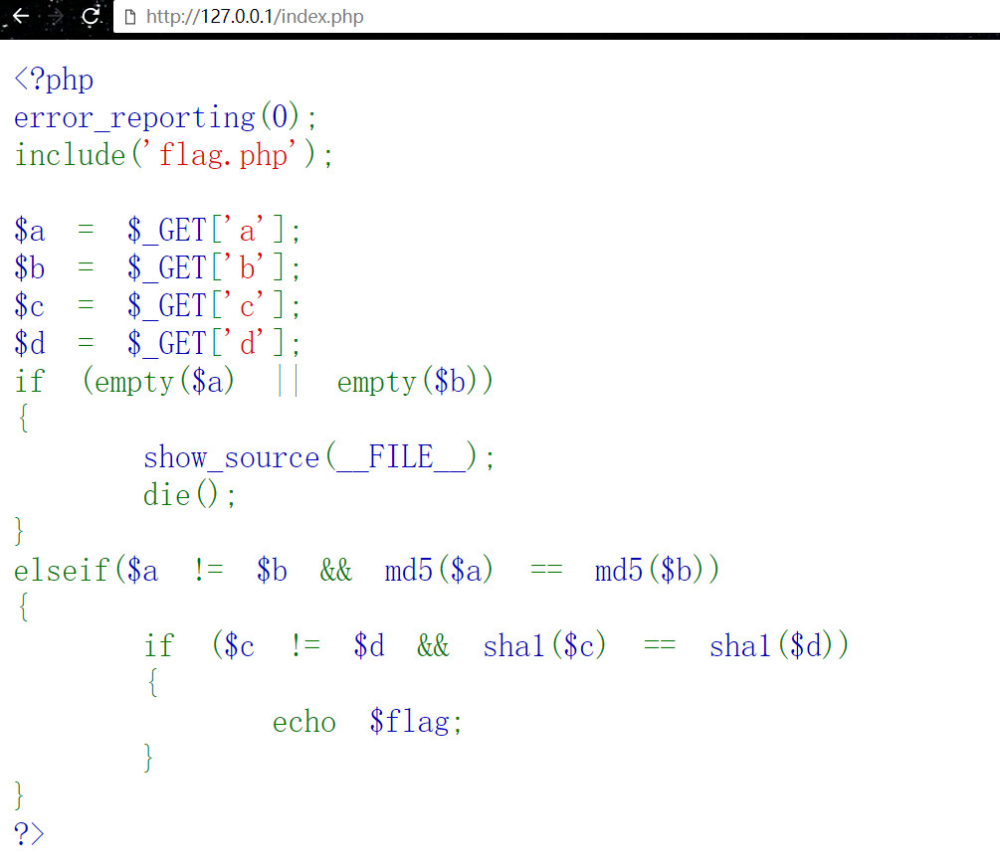
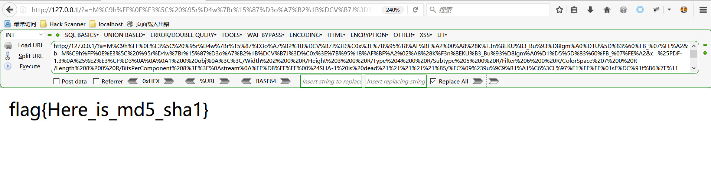

# 代码审计

```
<?php
error_reporting(0);
include('flag.php');

$a = $_GET['a'];
$b = $_GET['b'];
$c = $_GET['c']; 
$d = $_GET['d'];
if (empty($a) || empty($b)) 
{
    show_source(__FILE__);
    die();
}
elseif($a != $b && md5($a) == md5($b))
{
    if ($c != $d && sha1($c) == sha1($d)) 
    {
        echo $flag;
    }
}
?>
```

# 思路：
根据给出的代码，得知a与b不相等，但是a的md5sum和b的md5sum值要相等。
而且c与b不相等，但是c的sha1sum和d的sha1sum值要相等，满足如上条件才会输出flag。

# md5sum-same
```
>>>  md5sum *
008ee33a9d58b51cfeb425b0959121c9  message1.bin
008ee33a9d58b51cfeb425b0959121c9  message2.bin

98107fcc1bb99636a9bf73591d780d3a  text2urlencode.py

```
# sha1sum-same

利用shattered-1.pdf和shattered-2.pdf文件生成相同sha1sum值相同的文件file1和file2，sha1sum值为f92d74e3874587aaf443d1db961d4e26dde13e9c

ps: 因为pdf文件内容虽然不相同，但是sha1值相同，所以为了方便，生成文件比较小的file1和file2

```
dd bs=1 count=320 <shattered-1.pdf| sha1sum
记录了320+0 的读入
记录了320+0 的写出
320 bytes copied, 0.00796817 s, 40.2 kB/s
>>> f92d74e3874587aaf443d1db961d4e26dde13e9c

dd bs=1 count=320 <shattered-2.pdf| sha1sum
记录了320+0 的读入
记录了320+0 的写出
320 bytes copied, 0.00397215 s, 80.6 kB/s
>>> f92d74e3874587aaf443d1db961d4e26dde13e9c
```
```
>>> sha1sum *

38762cf7f55934b34d179ae6a4c80cadccbb7f0a  shattered-1.pdf
38762cf7f55934b34d179ae6a4c80cadccbb7f0a  shattered-2.pdf

f92d74e3874587aaf443d1db961d4e26dde13e9c  file1
f92d74e3874587aaf443d1db961d4e26dde13e9c  file2

c1d56638ae952f1e46da7716460bcc3c9e331eef  Text2Url.py

```

# 得到a和b值
```
________________________________________________________________________
#encoding=utf-8
import urllib


file1 = open("message1.bin", "rb")
file2 = open("message2.bin", "rb")
res1 = file1.read()
res2 = file2.read()
s1 = urllib.quote(res1)
s2 = urllib.quote(res2)
file1.close()
file2.close()
print 'a=%s'% s1 +'&'+'b=%s'% s2
________________________________________________________________________
>>> python text2urlencode.py 

a=M%C9h%FF%0E%E3%5C%20%95r%D4w%7Br%15%87%D3o%A7%B2%1B%DCV%B7J%3D%C0x%3E%7B%95%18%AF%BF%A2%00%A8%28K%F3n%8EKU%B3_Bu%93%D8Igm%A0%D1U%5D%83%60%FB_%07%FE%A2&b=M%C9h%FF%0E%E3%5C%20%95r%D4w%7Br%15%87%D3o%A7%B2%1B%DCV%B7J%3D%C0x%3E%7B%95%18%AF%BF%A2%02%A8%28K%F3n%8EKU%B3_Bu%93%D8Igm%A0%D1%D5%5D%83%60%FB_%07%FE%A2

```

# 得到c和d值
```
________________________________________________________________________
#encoding=utf-8
import urllib


file1 = open("file1", "rb")
file2 = open("file2", "rb")
res1 = file1.read()
res2 = file2.read()
s1 = urllib.quote(res1)
s2 = urllib.quote(res2)
file1.close()
file2.close()
print 'c=%s'% s1 +'&'+'d=%s'% s2
________________________________________________________________________

>>> python Text2Url.py 
c=%25PDF-1.3%0A%25%E2%E3%CF%D3%0A%0A%0A1%200%20obj%0A%3C%3C/Width%202%200%20R/Height%203%200%20R/Type%204%200%20R/Subtype%205%200%20R/Filter%206%200%20R/ColorSpace%207%200%20R/Length%208%200%20R/BitsPerComponent%208%3E%3E%0Astream%0A%FF%D8%FF%FE%00%24SHA-1%20is%20dead%21%21%21%21%21%85/%EC%09%239u%9C9%B1%A1%C6%3CL%97%E1%FF%FE%01sF%DC%91f%B6%7E%11%8F%02%9A%B6%21%B2V%0F%F9%CAg%CC%A8%C7%F8%5B%A8Ly%03%0C%2B%3D%E2%18%F8m%B3%A9%09%01%D5%DFE%C1O%26%FE%DF%B3%DC8%E9j%C2/%E7%BDr%8F%0EE%BC%E0F%D2%3CW%0F%EB%14%13%98%BBU.%F5%A0%A8%2B%E31%FE%A4%807%B8%B5%D7%1F%0E3.%DF%93%AC5%00%EBM%DC%0D%EC%C1%A8dy%0Cx%2Cv%21V%60%DD0%97%91%D0k%D0%AF%3F%98%CD%A4%BCF%29%B1&d=%25PDF-1.3%0A%25%E2%E3%CF%D3%0A%0A%0A1%200%20obj%0A%3C%3C/Width%202%200%20R/Height%203%200%20R/Type%204%200%20R/Subtype%205%200%20R/Filter%206%200%20R/ColorSpace%207%200%20R/Length%208%200%20R/BitsPerComponent%208%3E%3E%0Astream%0A%FF%D8%FF%FE%00%24SHA-1%20is%20dead%21%21%21%21%21%85/%EC%09%239u%9C9%B1%A1%C6%3CL%97%E1%FF%FE%01%7FF%DC%93%A6%B6%7E%01%3B%02%9A%AA%1D%B2V%0BE%CAg%D6%88%C7%F8K%8CLy%1F%E0%2B%3D%F6%14%F8m%B1i%09%01%C5kE%C1S%0A%FE%DF%B7%608%E9rr/%E7%ADr%8F%0EI%04%E0F%C20W%0F%E9%D4%13%98%AB%E1.%F5%BC%94%2B%E35B%A4%80-%98%B5%D7%0F%2A3.%C3%7F%AC5%14%E7M%DC%0F%2C%C1%A8t%CD%0Cx0Z%21Vda0%97%89%60k%D0%BF%3F%98%CD%A8%04F%29%A1

```

# Writeup：

Payload：



```
http://127.0.0.1/?a=M%C9h%FF%0E%E3%5C%20%95r%D4w%7Br%15%87%D3o%A7%B2%1B%DCV%B7J%3D%C0x%3E%7B%95%18%AF%BF%A2%00%A8%28K%F3n%8EKU%B3_Bu%93%D8Igm%A0%D1U%5D%83%60%FB_%07%FE%A2&b=M%C9h%FF%0E%E3%5C%20%95r%D4w%7Br%15%87%D3o%A7%B2%1B%DCV%B7J%3D%C0x%3E%7B%95%18%AF%BF%A2%02%A8%28K%F3n%8EKU%B3_Bu%93%D8Igm%A0%D1%D5%5D%83%60%FB_%07%FE%A2&c=%25PDF-1.3%0A%25%E2%E3%CF%D3%0A%0A%0A1%200%20obj%0A%3C%3C/Width%202%200%20R/Height%203%200%20R/Type%204%200%20R/Subtype%205%200%20R/Filter%206%200%20R/ColorSpace%207%200%20R/Length%208%200%20R/BitsPerComponent%208%3E%3E%0Astream%0A%FF%D8%FF%FE%00%24SHA-1%20is%20dead%21%21%21%21%21%85/%EC%09%239u%9C9%B1%A1%C6%3CL%97%E1%FF%FE%01sF%DC%91f%B6%7E%11%8F%02%9A%B6%21%B2V%0F%F9%CAg%CC%A8%C7%F8%5B%A8Ly%03%0C%2B%3D%E2%18%F8m%B3%A9%09%01%D5%DFE%C1O%26%FE%DF%B3%DC8%E9j%C2/%E7%BDr%8F%0EE%BC%E0F%D2%3CW%0F%EB%14%13%98%BBU.%F5%A0%A8%2B%E31%FE%A4%807%B8%B5%D7%1F%0E3.%DF%93%AC5%00%EBM%DC%0D%EC%C1%A8dy%0Cx%2Cv%21V%60%DD0%97%91%D0k%D0%AF%3F%98%CD%A4%BCF%29%B1&d=%25PDF-1.3%0A%25%E2%E3%CF%D3%0A%0A%0A1%200%20obj%0A%3C%3C/Width%202%200%20R/Height%203%200%20R/Type%204%200%20R/Subtype%205%200%20R/Filter%206%200%20R/ColorSpace%207%200%20R/Length%208%200%20R/BitsPerComponent%208%3E%3E%0Astream%0A%FF%D8%FF%FE%00%24SHA-1%20is%20dead%21%21%21%21%21%85/%EC%09%239u%9C9%B1%A1%C6%3CL%97%E1%FF%FE%01%7FF%DC%93%A6%B6%7E%01%3B%02%9A%AA%1D%B2V%0BE%CAg%D6%88%C7%F8K%8CLy%1F%E0%2B%3D%F6%14%F8m%B1i%09%01%C5kE%C1S%0A%FE%DF%B7%608%E9rr/%E7%ADr%8F%0EI%04%E0F%C20W%0F%E9%D4%13%98%AB%E1.%F5%BC%94%2B%E35B%A4%80-%98%B5%D7%0F%2A3.%C3%7F%AC5%14%E7M%DC%0F%2C%C1%A8t%CD%0Cx0Z%21Vda0%97%89%60k%D0%BF%3F%98%CD%A8%04F%29%A1
```

flag{Here_is_md5_sha1}
